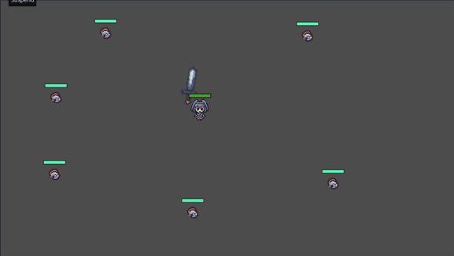
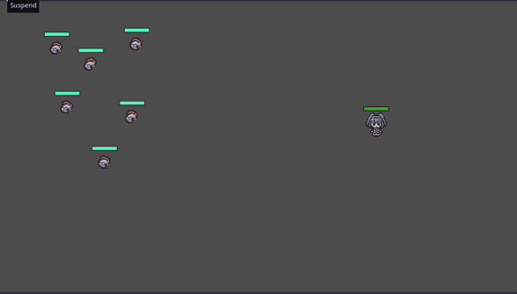
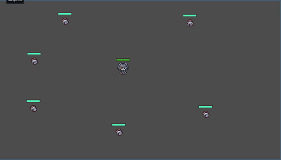
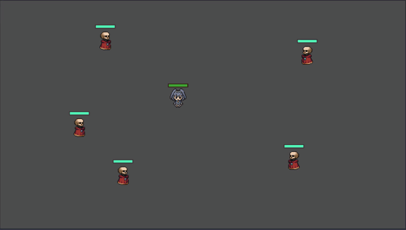
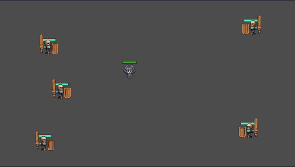

# A 2D Survivor-type Game inspired by Vampire Survivor & HoloCure

## Technically My First Game

This Project is made Open Source for Learning & Playing Purposes
This **DOES NOT** mean that Code & Implementations are Perfect, **not even close**.
You **WILL** observe **multiple** coding style changes, like I said, this is technically my first game, definitely my first Godot Game.

The Code quality is not high, noticeably it goes through at least 3 major style changes as I gradually get better at coding games & using Godot.

## If you want Higher Quality Code, Look forward to my Next Project:   A 3D Farming / Combat / Slowlife RPG

## Demo: Automode (implemented using simple logics and infinite health)

### Normal Attack:

### Gravity Spell:

### Static Taser Spell:

### Skeleton Mage Enemey:

### Dasher Enemy:

# You are Free to use anything in this project, other than Assets. They come from AI / Asset Packs I bought, use at your own risk. 
